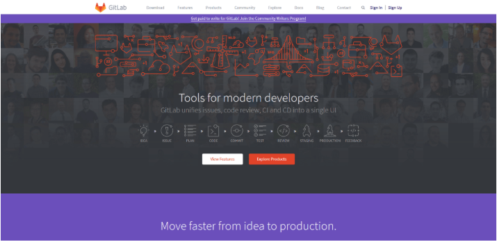
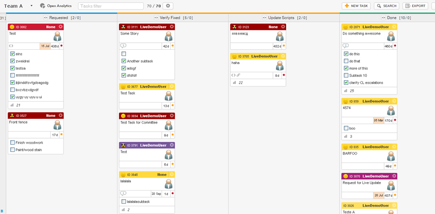
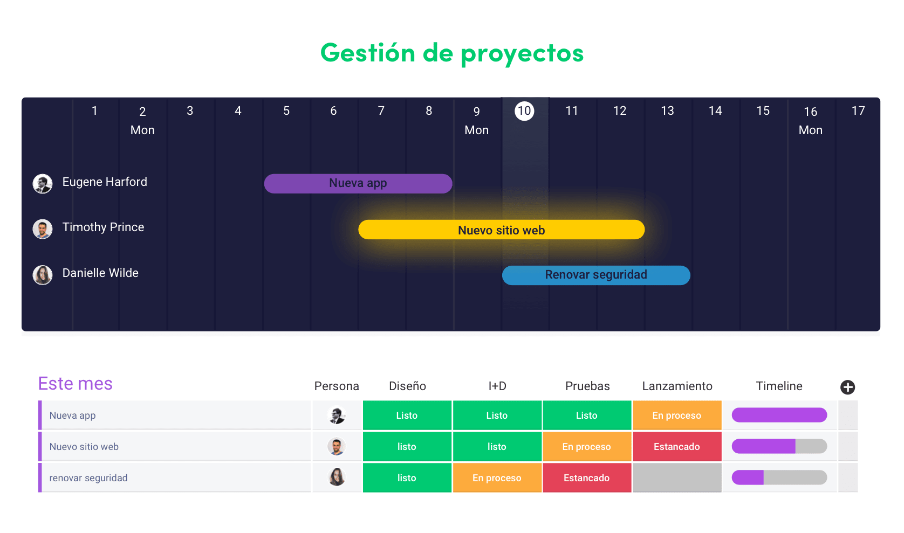
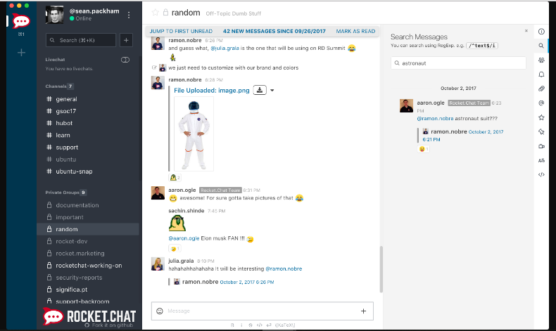
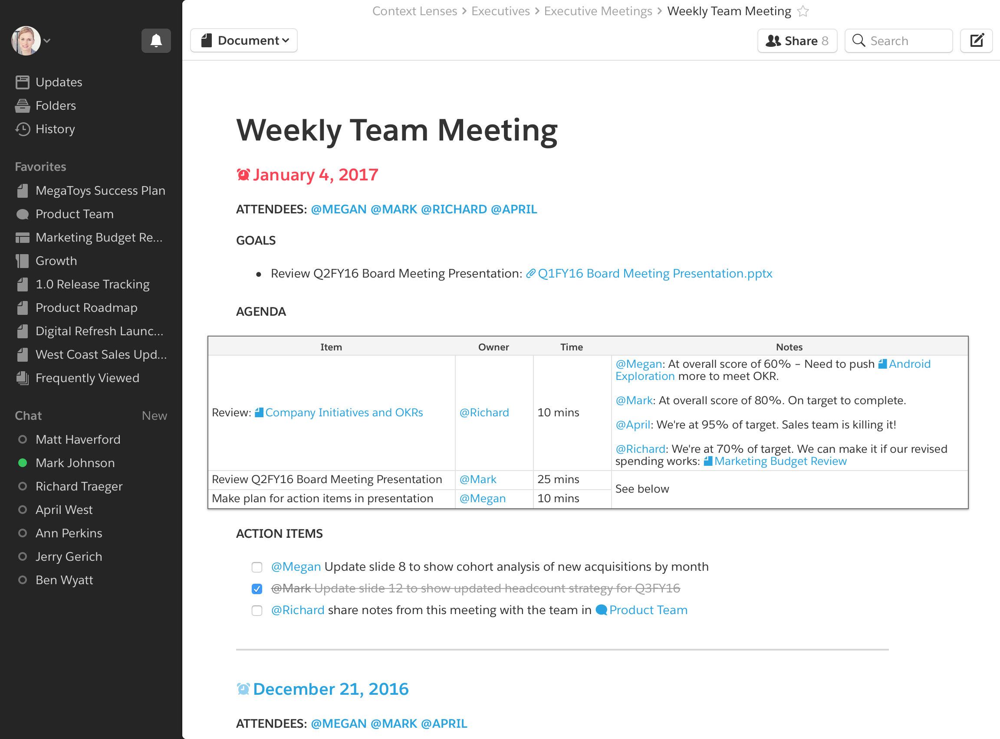

# Alternativas a las herramientas usadas en la práctica 1.
## Alternativas a Github
### Ventajas e inconvenientes de usar github.
- Una ventaja importante de GitHub es que el servicio pone a disposición de todos los usuarios repositorios de código públicos y libres sin límites. Sin embargo el mantenimiento de repositorios privados está sujeto a pago. También ofrece la posibilidad de crear “Organizaciones” que hacen las veces de cuentas regulares a menos que tengas un minino de una cuenta de usuario.
- A pesar de todo, tiene cierta limitaciones relativo a la facilidad de uso y eficiencia. En ocasiones surgen complicaciones entre el programa cliente y la compañía, por ejemplo, un servidor privado opera como host para el código creado. Otra de las razones de las razones que motivan la elección de alternativas a github es el empleo de un VCS diferente no soportado por GitHub. Como por ejemplo gitlab.

### Gitlab

 GitLab ofrece numerosas y útiles características en su DVCS, como, por ejemplo, un proyecto wiki integrado y una página web de proyecto. Las continuas capacidades de integración de GitLab automatizan el análisis y la entrega del código, lo que permite ahorrar tiempo en la fase de prueba. Con un visor de código, pull requests y un práctico método para solucionar conflictos. Permite acceder a todos los aspectos importantes de tu proyecto. La aplicación está escrita Ruby.

### Gitkraken

 GitKraken otorga un gran valor al ahorro de tiempo, algo que favorece a los usuarios a la hora de probar el código. al sistema se le conoce, principalmente, por tener una interfaz muy vistosa, por centrarse en la velocidad y por el fácil manejo de Git. Con un práctico botón para deshacer operaciones se pueden revisar errores al momento, lo que hace más facil el flujo de trabajo. La versión gratuita es apta para empresa de menos de 20 trabajadores u organizaciones sin ánimo de lucro. La versión Pro, ofrece características de gran utilidad, como por ejemplo el soporte de perfiles que permite separar proyectos con comodidad. 

## Alternativas a Trello
### Ventajas e inconvenientes de usar trello

#### Ventajas

- Desarrollo por tareas, agrupadas en paneles de trabajo. Puedes crear y ordenar tantos paneles como quieras.

- Las tareas disponen de un sistema de señalización para notificar de su prioridad, importancia… Puedes adjuntar fotos, iconos, comentarios… y además dividir la tarea en subtareas que según se completan van apareciendo en una línea porcentual hasta completarlas.

- Al igual que una red social, puedes crear múltiples perfiles para cada compañero de trabajo en los que puedes definir las tareas pendientes en sus respectivos paneles de trabajo.

- Dispone de versión para móvil, pero también se puede acceder desde el navegador de tu PC.

Y un largo etc. Estas son las que más nos gustan pero hay ventajas a destajo.

#### Inconvenientes

- No permite crear listas de trabajo repetitivas para poder hacer “ciclos” de tareas (Por ejemplo: X tareas cada lunes, o las tareas repetitivas de cada inicio de mes).

- Pero del tema de las desventajas… Lo que más nos convence es que dispone de paneles de tareas creados por los propios creadores de la APP donde explicar que quieres encontrar/mejorar y sistemas de votación para ver que desarrollos son los más demandados, por lo que cabe la posibilidad de que poco a poco vaya resolviendo los puntos negativos y mejorando… en todo. No es perfecta… Pero igual en breve sí.

### Kanbanize

Kanbanize ha cambiado la forma de los directores de proyectos y miembros del equipo hacen sus tareas. El sistema está cargado con una serie de herramientas y características que hacen fácil la gestión de proyectos, desde las fases iniciales de planificación y conceptualización a la realización y entrega. Kanbanize es conocida por su potente módulo de análisis y proporciona varios gráficos fuera de la caja y los datos se rellena automáticamente. Kanbanize amplía su funcionalidad mediante la vinculación de cualquier número de sistemas que son relevantes para su forma de trabajar.

Las evaluaciones usuario promedio de Kanbanize es 5/5.

### Monday.com

 monday.com es una plataforma de gestión del trabajo basada en la nube que proporciona una forma simplificada de gestionar el trabajo en equipo y los proyectos al tiempo que mejora la transparencia en su cultura corporativa.
El principal activo de monday.com es que no se limita a la gestión de proyectos digitales.
También puede usar monday.com para:

- Canalizaciones de ventas
- Campañas de marketing
- Procesos de reclutamiento
- Horarios de producción de video
- Gestión de tareas
- Monitoreo de progreso
- la estrategia de productos
- Procesos de negocio
- Seguimiento de errores
- Gestión de eventos
- Horarios de construcción

Y un largo etc...

Más de 80,000 equipos de todo el mundo confían en monday.com, desde grandes empresas como Wix y The Discovery Channel hasta pequeñas empresas que aún están en su infancia.
Los beneficios de monday.com
Personalización y control
monday.com es totalmente personalizable para satisfacer sus necesidades. De esta manera, puede definir su flujo de trabajo como mejor le parezca a usted y a su equipo. Esta es una de las muchas razones por las que muchos equipos de diferentes sectores y países han adoptado la plataforma.

## Alternativas a slack

### Ventajas e inconvenientes de slack

#### Ventajas

- Facil de utilizar.
- Permite la sincronización con otras aplicaciones como github, trello...

#### Inconvenientes
- No permite la conferencia por video o por voz.
- Hay funcionalidades de pago

### Rocket chat

Rocket chat es una aplicación de **código abierto** de comunicación entre el equipo, permite hacer conversaciones privadas entre los pertenecientes al grupo.

Además tienes la posibilidad de mandar videos y audios, y la funcionalidad de realizar conferencias de voz o video, carece de integración con otras herrmaientas

### Quip

Esta aplicación se vende como la alternativa a las redes sociales para la creación de proyectos, es usada por grandes empresas como facebook.

Esta aplicación, además de la funcionalidad de crear y compartir documentos de texto y hojas de calculo, se pueden crear archivos de acceso limitado para que solo puedan acceder personas con ciertos permisos, pero no tiene un sistema de gestión de contactos como si los tienen otros sistemas.
